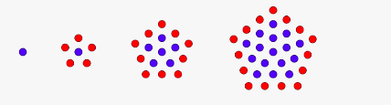

# Assignment - 2

### 1. Write a function that takes a positive integer num and calculates how many dots exist in a pentagonal shape around the center dot on the Nth iteration.

In the image below you can see the first iteration is only a single dot. On the second, there are 6 dots. On the third, there are 16 dots, and on the fourth there are 31 dots.

Return the number of dots that exist in the whole pentagon on the Nth iteration.

#### Examples

pentagonal(1) ➞ 1

pentagonal(2) ➞ 6

pentagonal(3) ➞ 16

pentagonal(8) ➞ 141

### 2.  Make a function that encrypts a given input with these steps:

Input: "apple"

Step 1: Reverse the input: "elppa"

Step 2: Replace all vowels using the following chart:

a => 0
e => 1
i => 2
o => 2
u => 3

-> "1lpp0"

Step 3: Add "aca" to the end of the word: "1lpp0aca"

Output: "1lpp0aca"

#### Examples

encrypt("banana") ➞ "0n0n0baca"

encrypt("karaca") ➞ "0c0r0kaca"

encrypt("burak") ➞ "k0r3baca"

encrypt("alpaca") ➞ "0c0pl0aca"

### 3. Given the month and year as numbers, return whether that month contains a Friday 13th.(i.e You can check Python's datetime module)

#### Examples

has_friday_13(3, 2020) ➞ True

has_friday_13(10, 2017) ➞ True

has_friday_13(1, 1985) ➞ False

### 4. Write a regular expression that will help us count how many bad cookies are produced every day. You must use RegEx negative lookbehind.

#### Example

lst = ["bad cookie", "good cookie", "bad cookie", "good cookie", "good cookie"]
pattern = "yourregularexpressionhere"

len(re.findall(pattern, ", ".join(lst))) ➞ 2

### 5. Given a list of words in the singular form, return a set of those words in the plural form if they appear more than once in the list.

#### Examples

pluralize(["cow", "pig", "cow", "cow"]) ➞ { "cows", "pig" }

pluralize(["table", "table", "table"]) ➞ { "tables" }

pluralize(["chair", "pencil", "arm"]) ➞ { "chair", "pencil", "arm" }
